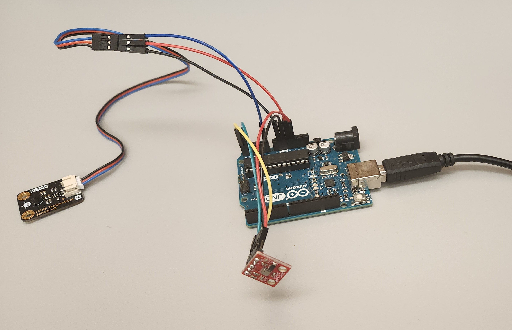

# TinyEKF: Lightweight C/C++ Extended Kalman Filter with Python for prototyping

TinyEKF is a simple, header-only C/C++ implementation of the
[Extended Kalman Filter](https://simondlevy.github.io/ekf-tutorial/) 
that is general enough to use on different projects.  It supports both single- and
double-precision floating-point computation.  In order to make it practical for
running on Arduino, STM32, and other microcontrollers, it uses static
(compile-time) memory allocation (no "new" or "malloc").  The **examples**
folder includes both a "pure C" example from the literature, as well as an
Arduino example of sensor fusion.  The **python** folder includes a Python
class that you can use to prototype your EKF before implementing it in C or C++.

Arduino users can simply install or drag the whole TinyEKF folder into their Arduino libraries folder. 
The **examples/SensorFusion** folder contains a little sensor fusion example using a 
[BMP180 barometer](https://www.sparkfun.com/products/11824) and 
[LM35 temperature sensor](http://www.robotshop.com/en/dfrobot-lm35-linear-temperature-sensor.html).
I have run this example on an Arduino Uno and a Teensy 3.2. The BMP180, being an I^2C sensor, should be connected
to pins 4 (SDA) and 5 (SCL) of the Uno, or pins 18 (SDA) and 19 (SCL) of the Teensy.  For other Arduino boards,
consult the [documentation](https://www.arduino.cc/en/Reference/Wire) on the Wire library. The analog output
from the LM35 should go to the A0 pin of your Arduino or Teensy.

In addition to the class definition, the **python** folder has an example of mouse tracking, using OpenCV. 
So you will have to install OpenCV to run this example. There is also a sensor-fusion example in this folder.
